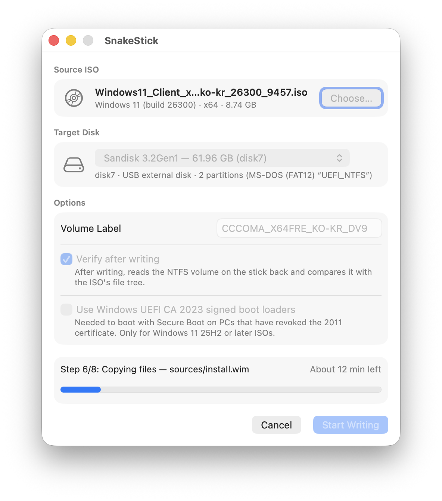

  

<h1 align="center">SnakeStick</h1>

  <b>Créez une clé USB d’installation de Windows 10 / 11 depuis votre Mac.</b> 
  Choisissez une ISO, choisissez une clé, lancez l’écriture. Pas de Terminal, pas de Boot Camp, pas besoin de découper <code>install.wim</code>.

  
  
  
  

  <a href="README.md">English</a> · <a href="README.ko.md">한국어</a> · <a href="README.ja.md">日本語</a> · <a href="README.zh-Hans.md">简体中文</a> · <a href="README.zh-Hant.md">繁體中文</a> · <a href="README.de.md">Deutsch</a> · <b>Français</b> · <a href="README.es.md">Español</a> · <a href="README.pt-BR.md">Português (Brasil)</a> · <a href="README.ru.md">Русский</a>

  

---

## ✨ Pourquoi SnakeStick

- 🪟 **Juste l’app.** Choisissez une ISO de Windows 10 ou 11 (ou déposez-la sur la fenêtre), choisissez une clé USB, cliquez sur **Lancer l’écriture**.
- 📦 **Les gros fichiers d’installation ne posent pas de problème.** Les ISO récentes de Windows contiennent un `install.wim` de plus de 4 Go,
  qu’une clé en FAT32 ne peut pas accueillir. SnakeStick place Windows sur une partition NTFS et ajoute une petite partition de démarrage
  avec le chargeur [UEFI:NTFS](https://github.com/pbatard/uefi-ntfs), selon la même disposition que [Rufus](https://rufus.ie). Rien n’est découpé.
- 🔐 **Compatible avec Secure Boot.** Le chargeur d’amorçage fourni est signé par Microsoft. Pour les PC qui ont révoqué le certificat
  de 2011 de Microsoft, SnakeStick peut utiliser les chargeurs d’amorçage signés Windows UEFI CA 2023 des ISO de Windows 11 25H2 ou ultérieure.
- ✅ **Il vérifie son propre travail.** Après l’écriture, il relit toute la clé et la compare à l’ISO, fichier par fichier.
- 🛡️ **Il ne touche pas aux disques de votre Mac.** Seuls les disques externes et amovibles sont listés. Les disques internes et le disque
  de démarrage n’apparaissent jamais, la destination est revérifiée juste avant l’écriture, et rien n’est effacé avant votre confirmation.
- 🧹 **Aucun résidu de Mac.** La partition Windows est écrite sans jamais être montée : aucun fichier `.DS_Store`, `._` ou
  `.fseventsd` ne se retrouve sur la clé.
- 🍎 **Une app Mac native.** Écrite en Swift et SwiftUI, disponible en anglais, coréen, japonais, chinois (simplifié et traditionnel),
  allemand, français, espagnol, portugais (Brésil) et russe. Libre et open source sous licence GPLv3.

## 📥 Téléchargement

Téléchargez la dernière version depuis l’onglet **[Releases](https://github.com/team-unstablers/SnakeStick/releases/latest)**,
puis déplacez **SnakeStick** dans votre dossier **Applications**. L’app est signée et notarisée par Apple.

## 🧰 Ce qu’il vous faut

| | |
|---|---|
| **Mac** | macOS Tahoe 26.6 ou ultérieur, et le mot de passe d’un administrateur |
| **ISO Windows** | Une ISO d’installation de Windows 10 ou 11, par exemple depuis la page de téléchargement de [Windows 11](https://www.microsoft.com/fr-fr/software-download/windows11) ou de [Windows 10](https://www.microsoft.com/fr-fr/software-download/windows10) de Microsoft |
| **Clé USB** | Assez grande pour l’ISO ; les clés trop petites sont grisées. 16 Go suffisent largement pour les ISO actuelles de Windows 11. |
| **PC cible** | Un PC qui démarre en mode UEFI. Le démarrage en BIOS hérité (CSM) n’est pas pris en charge. |

> [!CAUTION]
> L’écriture **efface tout** le contenu de la clé USB sélectionnée. Copiez d’abord ailleurs tout ce que vous voulez conserver.

## 🔑 Premier lancement : deux autorisations à donner une seule fois

SnakeStick écrit sur la clé par l’intermédiaire d’un petit outil d’assistance qui s’exécute en arrière-plan avec les droits
d’administrateur, si bien que l’app elle-même n’a jamais besoin de s’exécuter en root. macOS vous demande d’approuver cet outil une seule fois :

1. **Autorisez l’outil d’assistance.** La première fois que vous cliquez sur **Lancer l’écriture**, macOS vous demande d’autoriser l’outil
   d’assistance de SnakeStick. Activez **SnakeStick** dans **Réglages Système › Général › Ouverture et extensions**, puis réessayez.
2. **Accordez l’accès complet au disque.** macOS empêche les outils d’assistance en arrière-plan d’accéder aux disques amovibles et à des
   dossiers comme **Téléchargements**, sauf si l’app dispose de l’accès complet au disque. Ajoutez **SnakeStick** dans
   **Réglages Système › Confidentialité et sécurité › Accès complet au disque**. SnakeStick vous prévient quand cette autorisation manque
   et propose un bouton qui ouvre la bonne page.

Ensuite, SnakeStick vous demande votre mot de passe administrateur une fois à chaque écriture d’une clé.

## 🚀 Créer une clé

1. **Choisissez l’ISO.** Cliquez sur **Choisir…** sous **ISO source**, ou déposez l’ISO sur la fenêtre. SnakeStick affiche la
   version de Windows, l’architecture et la taille.
2. **Choisissez la clé.** Branchez-la et sélectionnez-la sous **Disque de destination**.
3. **Vérifiez les options.**
   - **Nom du volume** : le nom de la clé. Par défaut, c’est le nom de l’ISO elle-même.
   - **Vérifier après l’écriture** : activé par défaut. Cela ajoute quelques minutes, et elles en valent la peine.
   - **Utiliser les chargeurs d’amorçage signés Windows UEFI CA 2023** : nécessaire uniquement pour les PC qui ont révoqué le
     certificat Secure Boot de 2011 de Microsoft, et disponible uniquement avec les ISO de Windows 11 25H2 ou ultérieure. Dans le doute,
     laissez cette option désactivée.
4. **Cliquez sur Lancer l’écriture**, confirmez avec **Effacer et écrire**, puis saisissez votre mot de passe administrateur.
5. **Patientez.** La barre de progression indique l’étape en cours (8 au total) et le temps restant. Avec la clé USB 3 que nous avons
   testée, une ISO de Windows 11 de 8,7 Go a pris environ 16 minutes, vérification comprise.
6. Cliquez sur **Éjecter** quand SnakeStick indique que l’écriture est terminée.

Vous pouvez cliquer sur **Arrêter** à tout moment. La clé ne peut alors plus démarrer, et une nouvelle écriture reprend depuis le début.

## 💻 Démarrer le PC sur la clé

1. Branchez la clé sur le PC et allumez-le en appuyant sur la touche du menu de démarrage. Il s’agit généralement de **F12**, **F11**,
   **F8** ou **Échap** ; consultez le manuel de votre PC.
2. Sélectionnez l’entrée **UEFI** correspondant à la clé USB.
3. Le programme d’installation de Windows démarre.

Si le PC refuse de démarrer sur la clé avec Secure Boot activé, cherchez dans les réglages de son firmware une option comme
**« Allow Microsoft 3rd Party UEFI CA »** et activez-la. Certains PC, en particulier les Secured-core PC, sont livrés avec cette option
désactivée, alors que le chargeur d’amorçage UEFI:NTFS en a besoin. Désactiver Secure Boot le temps de l’installation fonctionne aussi ;
réactivez-le ensuite.

## ❓ FAQ

<b>Pourquoi a-t-il besoin de l’accès complet au disque ?</b>

 

La partie de SnakeStick qui écrit sur la clé est un outil d’assistance en arrière-plan (un daemon launchd). macOS ne permet pas à ces
outils d’ouvrir des disques amovibles, ni de lire une ISO dans des dossiers comme Téléchargements, sauf si l’app à laquelle ils
appartiennent dispose de l’accès complet au disque, et il n’existe pas d’autorisation plus restreinte qu’un outil d’assistance puisse
demander. Vous l’accordez à l’app SnakeStick, et elle s’étend à l’outil d’assistance qu’elle contient.

<b>Pourquoi ne pas simplement formater la clé en FAT32, comme le faisait l’Assistant Boot Camp ?</b>

 

FAT32 ne peut pas contenir de fichier de 4 Go ou plus, et le `sources/install.wim` des ISO actuelles de Windows est généralement plus
volumineux que cela. La solution habituelle consiste à découper le fichier. SnakeStick le conserve plutôt entier sur une partition NTFS,
et une minuscule partition FAT placée à côté contient le chargeur UEFI:NTFS, qui apprend au firmware du PC à lire le NTFS.

<b>Peut-il contourner les exigences de TPM ou de Secure Boot de Windows 11 ?</b>

 

Non. SnakeStick copie l’ISO telle quelle. Il ne contourne pas la configuration matérielle requise, n’ajoute pas de fichiers de réponses
pour les installations sans assistance et n’injecte pas de pilotes.

<b>Que se passe-t-il si je retire la clé ou si j’arrête en cours de route ?</b>

 

SnakeStick fait le ménage derrière lui, et la clé ne peut plus démarrer. Relancez l’écriture et tout rentrera dans l’ordre. Les disques
de votre Mac ne sont jamais touchés.

<b>Puis-je créer une image disque au lieu d’écrire sur une clé ?</b>

 

Pas depuis l’app. SnakeStick écrit uniquement sur des clés USB.

> [!NOTE]
> SnakeStick est encore jeune. Des clés créées avec lui ont démarré jusqu’au programme d’installation de Windows sur un PC x64 avec
> Secure Boot activé, mais aucune installation complète de Windows à partir de l’une d’elles n’a encore été testée. En cas de problème,
> [ouvrez un ticket](https://github.com/team-unstablers/SnakeStick/issues) et joignez-y le journal (**Afficher le journal…** dans l’app).

## 🙏 Construit avec

SnakeStick n’existerait pas sans ces logiciels libres. Merci !

- [ntfs-3g](https://github.com/tuxera/ntfs-3g) : crée la partition NTFS et y écrit
- [UEFI:NTFS](https://github.com/pbatard/uefi-ntfs) : le chargeur d’amorçage qui permet au firmware UEFI de démarrer Windows depuis le NTFS
- [wimlib](https://github.com/ebiggers/wimlib) : lit l’image de démarrage de Windows
- [Rufus](https://github.com/pbatard/rufus) : son code source a servi de référence

SnakeStick a été écrit par un agent de programmation basé sur un LLM, sous supervision humaine.

## 🐍 À propos de l’icône

Le serpent de l’Éden, qui tend une pomme à votre Mac. La pomme est intacte : personne n’y a encore croqué.

## 🛠️ Pour les développeurs

Le fonctionnement de SnakeStick, la compilation depuis les sources et l’exécution des tests : voir [docs/DESIGN.md](docs/DESIGN.md).

## 📄 Licence

SnakeStick est un logiciel libre distribué sous la [GNU General Public License v3.0 ou ultérieure](COPYING). Il est fourni sans aucune
garantie. Les composants inclus conservent leurs propres licences ; voir [docs/DESIGN.md](docs/DESIGN.md#license).
